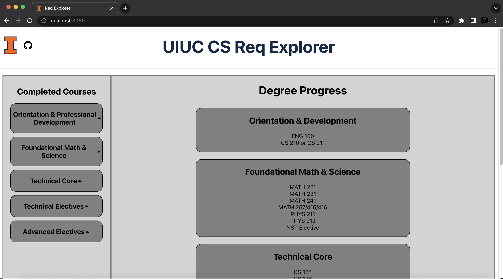

# uiuc-cs-req-gui

## About
* Web app built with React, Express.js
* Provides user interface for interacting with UIUC CS Major degree requirements
* Technical core and technical elective requirement data scraped from [Illinois' Course Catalog](http://catalog.illinois.edu/undergraduate/engineering/computer-science-bs/#degreerequirementstext) using Beautiful Soup 4
* Backend also serves [Illinois' prerequisite course data](https://github.com/illinois/prerequisites-dataset)

---

---

## Usage
* Clone repository to local machine
* Enter `client` directory and run `npm run build` to generate production build.
* From the project root directory, run `node .` to start server.
* Navigate to http://localhost:3080
